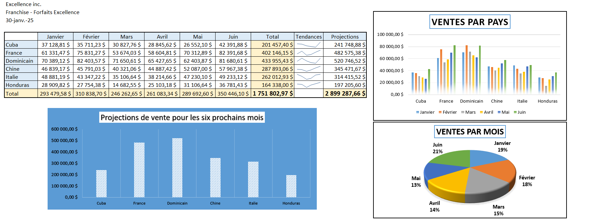

# Excel Analytics Portfolio

A collection of practical **Excel projects** showcasing data analysis, KPIs, dashboards, and business insights.  
Each project includes a workbook (`.xlsx`) with formulas, pivot tables, and (optionally) screenshots.

---

##  Project Index

| Project | Domain | Highlights | File |
|---|---|---|---|
| **HR Analytics – Salaries, Overtime & Sick Leave** | HR / Operations | KPIs, overtime cost calculation (configurable rate), sick-leave analysis via Pivot | `SBH Excel-hr-analytics.xlsx` |
| **Income Statement (P&L)** | Finance / Accounting | Structured Income Statement template, period comparisons, clean categories | `Income Statement.xlsx` |
| **Sales by Country** | Sales / Retail | Country-level sales comparison, rankings, quick summaries with Pivot | `Sales By country.xlsx` |

---

##  Skills Demonstrated

- Excel formulas: `SUMIF`, `SUMIFS`, `AVERAGEIF`, `COUNTIF`, `ROUND`, `DATEDIF`, `NETWORKDAYS`, text concatenation  
- Pivot Tables for fast grouping and comparisons  
- KPI design and business storytelling in spreadsheets  
- Clean worksheet structuring and light data modeling

---

##  Files in This Repository

- `SBH Excel-hr-analytics.xlsx` – HR analytics workbook (salaries, overtime, sick leave)  
- `Income Statement.xlsx` – Income Statement (P&L) template  
- `Sales By country.xlsx` – Sales by country analysis  
- `README.md` – You are here  
- `README Excel.md` – (Optional) extra notes; can be merged into this README

---

## Screenshots 

 Author: Selim Ben Halima
 - LinkedIn: https://www.linkedin.com/in/selim-benhalima/
  - GitHub : https://github.com/SelimBenHalima-web/Portfolio-analytics
